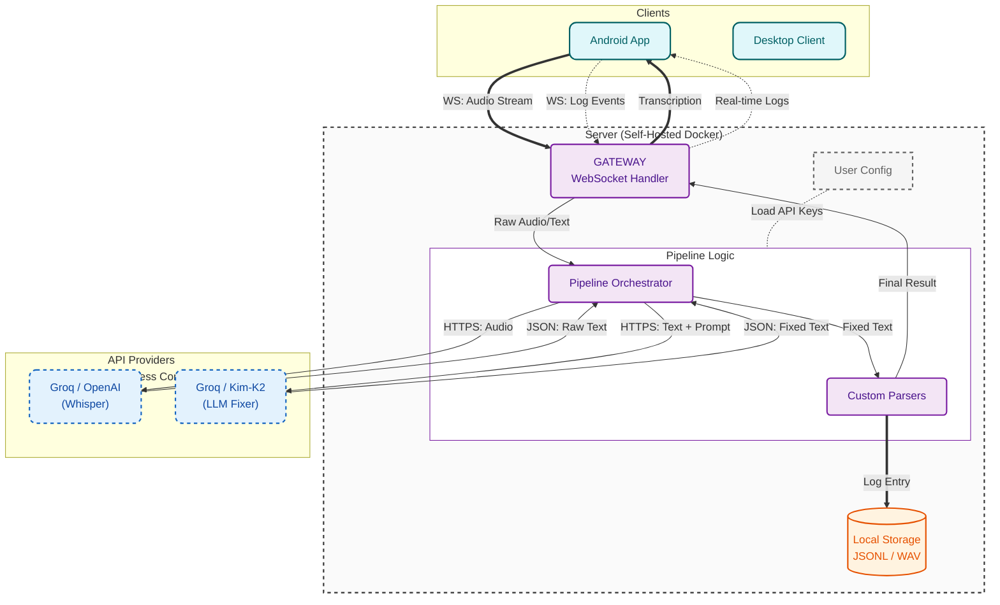

<div align="center">
  
  <h1>Reliquary</h1>
  <p><strong>Your Digital Phylactery</strong></p>

  <p>
    <a href="#-quick-start-clients">Download Client</a> •
    <a href="#-deploy-your-fortress-server">Deploy Server</a> •
    <a href="#-architecture">Architecture</a>
  </p>

  
  
  
</div>

## Don't be the AI's Bottleneck

Modern LLMs possess terrifying reasoning capabilities. Yet, you are utilizing less than 1% of their potential. Why?

Because you are physically locked by the keyboard.

Only extreme voice input can unlock your brain. Reliquary converts voice to text, creating a zero-burden stream of thought that connects you to the "high-bandwidth fiber" of the super-individual.

It lets you throw away the keyboard and interact with AI at the speed of thought.

## Core Features

### 1. Zero Friction Streaming

- Forget grammar. Forget logic. Don't organize your language.
Reliquary allows you to ramble in a "flow state". Whether eating, walking, or lying down, just spray your raw thoughts out. The LLM has your back.

### 2. Context-Aware Repair

- Interacting with AI doesn't require the words to be correct. Reliquary cares if the INTENT is correct.

- The Fixer Pipeline: Uses an internal LLM to automatically fix typos, add punctuation, and even format code blocks.

- It doesn't chase 100% verbatim accuracy; it chases 100% Intent Transmission.

### 3. Your Data, Your Rules

- **Local First**: All data stored locally.
- **Private Memory**: Your chat history is your personal "private training set".
- **No SaaS BS**: Refuse subscriptions, refuse data used for training by big tech.

### 4. 1000% FREE (Open Source)

- **Open Source**: Code fully open source (MIT), no paywall.
- **Zero Cost**: LLM API optimized for Groq's free tier.

## Why Reliquary?

| Feature | Traditional Voice (Siri/ChatGPT Voice) | Traditional Notes (Notion/Obsidian) | Reliquary |
| :--- | :--- | :--- | :--- |
| **Interaction** | Short Commands (Turn-based) | Structured Archiving | **Stream of Thought (Streaming)** |
| **Interruption** | Aggressive Silence Detection | None | **No Interruption (Think as long as you want)** |
| **Data Home** | Big Tech Servers (Training fodder) | Cloud Database | **Local Docker (Your Hard Drive)** |
| **Cost** | Free but dumb / Subscription | Subscription / Buyout | **Open Source & Free (MIT)** |
| **Core Value** | Convenience | Storage | **Expand Brain Bandwidth** |

## Vision & Roadmap

We are not just building an App; we are dedicated to building a **Reliquary Interaction Protocol (RIP)**.

- **Current Pain Point**: There is a huge gap between human natural language flow (Unstructured) and machine structured data (Structured).
- **Our Goal**: Define a common Schema, making Reliquary the universal interface between the human brain and the digital world.

Imagine:
- You no longer need to manually organize Notion, because Reliquary automatically structures and archives your voice logs.
- You no longer need to recall details of last week's meeting, because the local vector database has indexed all your data.

Reliquary is your exocortex input port. It is currently an efficient voice recorder; in the future, it will be the data cornerstone of your digital life.

**Phase 1: Core Stability (Current)**
  - [x] Multi-platform coverage (Android, Windows, macOS, Linux)
  - [x] High-precision transcription & context repair (Fixer Pipeline)
  - [x] Self-hosting & Data Sovereignty (Docker)

**Phase 2: Protocol & Interconnection (Next Step)**
  - [ ] Define Interaction Protocol: Establish standardized input/output formats (JSON Schema). Whether you use a phone, watch, or future smart glasses, as long as they follow this protocol, data can flow into your "Phylactery".
  - [ ] Ecosystem Expansion: Support pushing standardized data to Obsidian, Notion, S3, cloud storage, or any third-party system, enabling automated workflows.

**Phase 3: Data Intelligence & Exocortex (Future)**
  - [ ] Local Vector Retrieval (RAG): Your data no longer sleeps. Through local vectorization, you can ask your past at any time: "What was that idea I had about architecture last month?"
  - [ ] Agent Proactive Reminder: An assistant based on long-term memory that proactively discovers blind spots in your thinking.
  - [ ] Quantified Self: Automatically generate daily, weekly, and annual reports, letting you rediscover yourself through data.

## Quick Start: Clients

Before starting, you need a running server (see Deployment below).

- **macOS (Homebrew)**
  ```bash
  brew tap sentimentalK/reliquary
  brew install reliquary
  ```

- **Windows (Scoop)**
  ```powershell
  scoop bucket add reliquary https://github.com/SentimentalK/scoop-bucket
  scoop install reliquary
  ```

- **Android**
  Download the latest APK from [GitHub Releases](https://github.com/SentimentalK/reliquary/releases).
  
  **Client Setup Guide**: Once installed, point your client to your server URL. Read the Connection Guide.

## Deploy Your Fortress (Server)

You have three ways to run the Reliquary Core.

- **Option A: "Instant Trial" (Web Demo)**
  ```markdown
  Don't have a server yet? You can try our demo environment first.
  [Enter Demo Environment](#http://localhost:3000)
  
  > Note: For functional preview only, not for commercial use. Due to limited server resources, all accounts and data are automatically cleaned up 24 hours after registration. For long-term use, please refer to the self-hosting solutions below.
  ```

- **Option B: Local Deployment (Dev/Test Drive)**
  Run the full stack on your laptop (build from source).
  1. **Clone Repo**:
     ```bash
     git clone https://github.com/SentimentalK/reliquary.git
     cd reliquary
     ```
  2. **Config**:
     ```bash
     cp .env.example .env
     # Edit .env and add your GROQ_API_KEY
     ```
  3. **Launch**:
     ```bash
     docker-compose up -d --build
     ```
  4. **Access**:
        - Frontend: `http://localhost:3000`
        - Backend API: `http://localhost:8080/api/`

- **Option C: Production Server (Recommended)**
  Deploy directly using pre-built images from GitHub Container Registry (GHCR). Suitable for running 24/7 on a VPS (AWS, DigitalOcean, Hetzner). Includes automatic HTTPS via Caddy.
  
  **Prepare**: A domain name pointing to your server IP.
  1. **Config**:
     - **Edit .env**: Set `DOMAIN_NAME=yourdomain.com` and API Keys.
     - **Edit Caddyfile**: Replace `:80` with `yourdomain.com`.
  2. **Deploy**:
     ```bash
     docker-compose -f docker-compose.prod.yml up -d
     ```
     This command will pull the latest images and start Gateway (Caddy), Frontend, and Backend.
  3. **Connect**: Use `https://yourdomain.com` in your mobile/desktop clients.

## Architecture

Reliquary uses a **Chain of Responsibility** design pattern to handle audio streams.



**Whisper**: Provides the raw transcription foundation.

**The Fixer**: A specialized LLM Agent that uses context to correct homophones, add punctuation, and format code blocks.

## 📜 License & Trademarks

**License**: This project is open-source under the MIT License. You are free to fork, modify, and distribute the code.

**Trademarks**:
The "Reliquary" name and the Logo (located in `web/public/logo.svg`) are trademarks of the project creator.

✅ You **MAY** use the logo for personal use or when deploying an unmodified version of this software.

❌ You **MAY NOT** use the logo to endorse derived works or commercial products without explicit permission.

<div align="center">
<em>Unlock your digital soul.

Deploy Reliquary.</em>
</div>