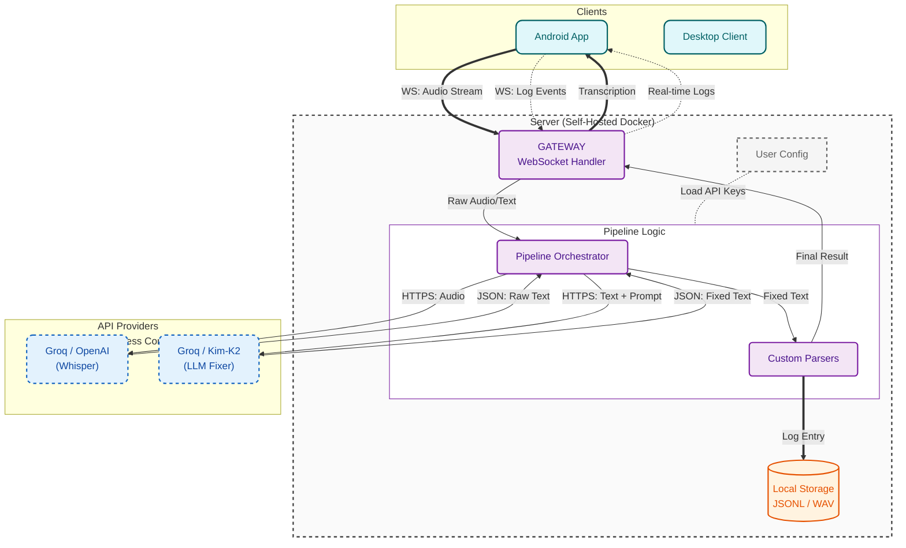

<div align="center">
  
  <h1>Reliquary</h1>
  <p><strong>Your Digital Phylactery</strong></p>

  <p>
    <a href="#-quick-start-clients">Download Client</a> •
    <a href="#-deploy-your-fortress-server">Deploy Server</a> •
    <a href="#-architecture">Architecture</a>
  </p>

  
  
  
</div>

## What is Reliquary?

Reliquary is a **Self-Hosted** personal digital asset I/O protocol. It is not just a high-precision voice input terminal, but a **"Digital Phylactery"** for your mind. It solves not only the "speech-to-text" problem, but the triple dilemma of interaction between modern humans and the digital world:

- **Friction Kills Flow**
  Inspiration is fleeting. The process of pulling out a phone, opening a note app, and tapping on a keyboard is too cumbersome. Typing speed (40-60 wpm) lags far behind thinking speed (150+ wpm). This mismatch causes massive amounts of high-value thought fragments to dissipate due to "friction".

- **Write-Only Memory**
  Even if you record it, most notes become "dead data". Notebooks (whether paper or Notion) often become graveyards for thoughts—you only store, but rarely efficiently retrieve or utilize. Unstructured and unindexed thoughts are worthless.

- **SaaS Feudalism**
  Existing voice assistants are "walled gardens", not your "Exocortex".
  - **Uncontrollable**: Aggressive silence detection interrupts your thinking and pollutes context.
  - **Not Yours**: Your data becomes fodder for training large models.
  - **Ephemeral**: To big tech, your personal memories are low-value data, liable to be cleaned up or ignored by algorithms at any time.

It transforms your fleeting biological signals (voice) into eternal, structured digital assets (Relics) for future you (or your personal Agent) to mine indefinitely.

## Developer's Note (Top 0.1% AI Power User):

> *"Reliquary is the phylactery where I store my digital soul. It records the past and unlocks the future."*

My original motivation for building Reliquary was purely utilitarian: I could not tolerate slow typing dragging down my brain. I needed a **"Mind Buffer"** that allowed me to clear my logic by **"Thinking Aloud"** without being interrupted by any UI interactions.

But in the process of building it, I saw a deeper crisis: **Data is Mana**.

If the future leading to AGI is an era of magic, then your data is your mana pool. Now, you are handing over all your mana to cloud giants. They possess insight across time, linking your discomfort from months ago to today's symptoms to provide clues for early cancer detection, while we have nothing. Why can't we build this database ourselves, letting all AI models serve us from the same starting line?

**Reliquary aims to fill this gap.**
I don't want my data fragmented across ten SaaS islands. I want to build a unified, Raw Data level **Mind Data Lake**.
When the future GPT-10 or local AI Agent arrives, I will have a warehouse full of "soul slices" for it to read. It will instantly become the deputy who understands me best in this world, because I possess a memory backup of this entire era.

Reliquary is not just speech-to-text + recording; it is your confidence in facing the AI era.

## Why Choose Reliquary?

**1. Ultimate Efficiency**
  **Built for "Thinking Aloud", eliminating the anxiety of being interrupted.**
  - Most voice assistants have aggressive silence detection. If you pause to think, it decides input is finished and starts processing. Although some platforms allow you to interrupt the AI's reply, this mechanism breaks your flow and pollutes the context. You never know how much the AI heard or if the context of the previous sentence still holds.
  - Voice input provides a **"Mind Buffer"**, allowing you to organize language, correct logic, and even think in silence. Ultimately, you provide AI with deliberate **Clean Data**, not noise-filled fragments. This lets AI focus on solving problems rather than guessing riddles.
  - **Asynchronous Parallel Thinking**: Break the linear "Ask-Wait-Reply" loop. You can continuously throw out multiple complex voice prompts, using the time AI takes to process to think about the next sub-problem. Don't let AI replace your thinking; let AI catch up to your speed.

**2. Zero Cost, Enterprise Grade**
  - **The Fixer**: Reliquary doesn't just transcribe; it repairs. A context-aware LLM Agent (running on open-source models) automatically fixes homophones, adds punctuation based on tone, and even formats code blocks.
  - **Highly Programmable**: Reliquary is extremely flexible. Whether you know code or not, you can define "correction rules" in natural language.
  - **API Economics Hack**: By leveraging the generous Free Tier of modern API providers (mainly Groq). You can send hundreds of high-context instructions daily, enjoying enterprise-level response speed and accuracy at zero cost.

**3. Digital Phylactery Mechanism**
  - **Full Retention**: Stores Raw Audio, Raw Text, Fixed Text, and Metadata.
  - **Future-Proofing**: Maybe today's models can't analyze the micro-tremors in your tone, but tomorrow's will. As long as you hold the raw data, you are constantly accumulating future assets.
  - **One-Click Docker Deploy**: Your data is locked on your physical hard drive (VPS/NAS). This is your digital fortress, refusing any cloud censorship or deletion.
  - **Custom Value Anchor**: To big tech, your data is a drop in the ocean; they only store what's valuable to algorithms. In Reliquary, you define what is important. You are building your own memory library, not part of a big tech profile.

**4. Programmable I/O Port**
  **Reliquary is a set of Lego blocks for voice processing.**
  - **Pipeline**: VAD -> Transcription -> Fixer -> Custom Parsers. Want to mask sensitive words before storage? Want to extract Todos to a Kanban board? The pipeline is yours to define.
  - **Modular Pipeline**: All processing steps are modular.
  - **Lightweight & Ubiquitous**: All heavy logic resides on the server. Clients (Android/Desktop) are razor-thin, instant-on, and battery-friendly—pure input terminals for your exocortex.

## Vision & Roadmap

We are not just building an App; we are dedicated to building a **Reliquary Interaction Protocol (RIP)**.

- **Current Pain Point**: There is a huge gap between human natural language flow (Unstructured) and machine structured data (Structured).
- **Our Goal**: Define a common Schema, making Reliquary the universal interface between the human brain and the digital world.

Imagine:
- You no longer need to manually organize Notion, because Reliquary automatically structures and archives your voice logs.
- You no longer need to recall details of last week's meeting, because the local vector database has indexed all your data.

Reliquary is your exocortex input port. It is currently an efficient voice recorder; in the future, it will be the data cornerstone of your digital life.

**Phase 1: Core Stability (Current)**
  - [x] Multi-platform coverage (Android, Windows, macOS, Linux)
  - [x] High-precision transcription & context repair (Fixer Pipeline)
  - [x] Self-hosting & Data Sovereignty (Docker)

**Phase 2: Protocol & Interconnection (Next Step)**
  - [ ] Define Interaction Protocol: Establish standardized input/output formats (JSON Schema). Whether you use a phone, watch, or future smart glasses, as long as they follow this protocol, data can flow into your "Phylactery".
  - [ ] Ecosystem Expansion: Support pushing standardized data to Obsidian, Notion, S3, cloud storage, or any third-party system, enabling automated workflows.

**Phase 3: Data Intelligence & Exocortex (Future)**
  - [ ] Local Vector Retrieval (RAG): Your data no longer sleeps. Through local vectorization, you can ask your past at any time: "What was that idea I had about architecture last month?"
  - [ ] Agent Proactive Reminder: An assistant based on long-term memory that proactively discovers blind spots in your thinking.
  - [ ] Quantified Self: Automatically generate daily, weekly, and annual reports, letting you rediscover yourself through data.

## Quick Start: Clients

Before starting, you need a running server (see Deployment below).

- **macOS (Homebrew)**
  ```bash
  brew tap sentimentalK/reliquary
  brew install reliquary
  ```

- **Windows (Scoop)**
  ```powershell
  scoop bucket add reliquary https://github.com/SentimentalK/scoop-bucket
  scoop install reliquary
  ```

- **Android**
  Download the latest APK from [GitHub Releases](https://github.com/SentimentalK/reliquary/releases).
  
  **Client Setup Guide**: Once installed, point your client to your server URL. Read the Connection Guide.

## Deploy Your Fortress (Server)

You have three ways to run the Reliquary Core.

- **Option A: "Instant Trial" (Web Demo)**
  ```markdown
  Don't have a server yet? You can try our demo environment first.
  [Enter Demo Environment](#http://localhost:3000)
  
  > Note: For functional preview only, not for commercial use. Due to limited server resources, all accounts and data are automatically cleaned up 24 hours after registration. For long-term use, please refer to the self-hosting solutions below.
  ```

- **Option B: Local Deployment (Dev/Test Drive)**
  Run the full stack on your laptop (build from source).
  1. **Clone Repo**:
     ```bash
     git clone https://github.com/SentimentalK/reliquary.git
     cd reliquary
     ```
  2. **Config**:
     ```bash
     cp .env.example .env
     # Edit .env and add your GROQ_API_KEY
     ```
  3. **Launch**:
     ```bash
     docker-compose up -d --build
     ```
  4. **Access**:
        - Frontend: `http://localhost:3000`
        - Backend API: `http://localhost:8080/api/`

- **Option C: Production Server (Recommended)**
  Deploy directly using pre-built images from GitHub Container Registry (GHCR). Suitable for running 24/7 on a VPS (AWS, DigitalOcean, Hetzner). Includes automatic HTTPS via Caddy.
  
  **Prepare**: A domain name pointing to your server IP.
  1. **Config**:
     - **Edit .env**: Set `DOMAIN_NAME=yourdomain.com` and API Keys.
     - **Edit Caddyfile**: Replace `:80` with `yourdomain.com`.
  2. **Deploy**:
     ```bash
     docker-compose -f docker-compose.prod.yml up -d
     ```
     This command will pull the latest images and start Gateway (Caddy), Frontend, and Backend.
  3. **Connect**: Use `https://yourdomain.com` in your mobile/desktop clients.

## Architecture

Reliquary uses a **Chain of Responsibility** design pattern to handle audio streams.



**Whisper**: Provides the raw transcription foundation.

**The Fixer**: A specialized LLM Agent that uses context to correct homophones, add punctuation, and format code blocks.

## 📜 License & Trademarks

**License**: This project is open-source under the MIT License. You are free to fork, modify, and distribute the code.

**Trademarks**:
The "Reliquary" name and the Logo (located in `web/public/logo.svg`) are trademarks of the project creator.

✅ You **MAY** use the logo for personal use or when deploying an unmodified version of this software.

❌ You **MAY NOT** use the logo to endorse derived works or commercial products without explicit permission.

<div align="center">
<em>Unlock your digital soul.

Deploy Reliquary.</em>
</div>