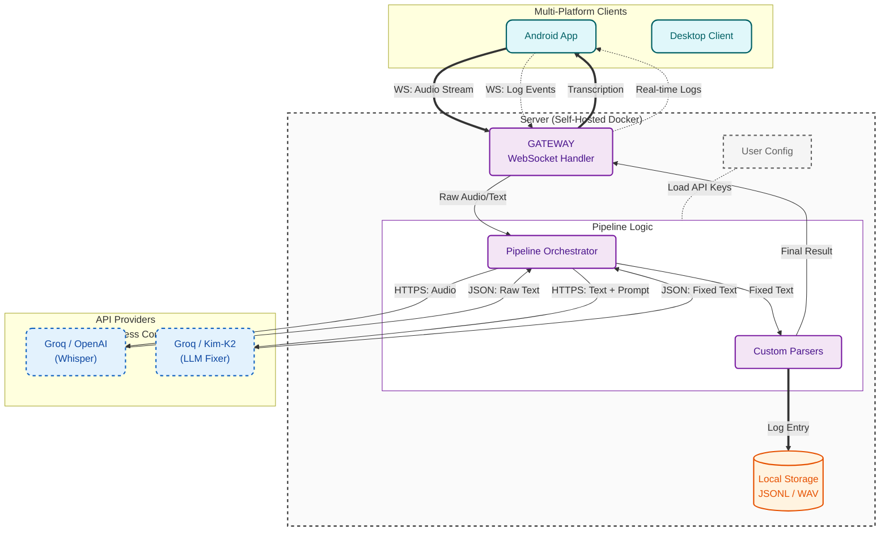

<div align="center">
  
  <h1>Reliquary</h1>
  <p><strong>Run Your AI Exocortex at Full Power</strong></p>

  <p>
    <a href="#connect-clients">Download Client</a> •
    <a href="#deploy-your-digital-fortress-server">Deploy Server</a> •
    <a href="#architecture">Architecture</a> •
    <a href="docs/README.zh-CN.md">中文版</a>
  </p>

  
  
  
</div>

## Why I Built This Project

**Without large language models (LLMs), Reliquary shouldn't exist.** Its sole value lies in shattering the input bottleneck, acting as a high-bandwidth pipeline perfectly tuned for human-AI token streams.

You are likely paying a premium for flagship LLMs, yet the physical QWERTY bottleneck leaves 99% of their capabilities tapped out. Reliquary unblocks this. As a power user, my daily throughput using this tool consistently redlines top-tier models.

Current voice interaction tooling is fundamentally flawed:

- **The free tier is broken**: Plagued by hallucinated transcripts. Miss one domain-specific term, and your downstream prompt turns into complete garbage (GIGO).
- **SaaS traps**: You pay extra for marginally better inference, while explicitly locking your most intimate thought processes inside a walled garden.
- **Zero fault tolerance**: Brainstorm for two minutes, and a single network hiccup or API timeout sends your entire context straight to `/dev/null`. You're left staring at the void. It’s a devastating UX.

Reliquary is a high-bandwidth exocortex interface engineered to solve this. It’s not a voice recorder—it’s an LLM-assisted thought funnel. It untethers you from the keyboard, enabling true speed-of-thought interaction, and finally delivers the ROI you deserve from your premium AI runtimes.

## Core Features

### 1. Absolute Certainty (The Fixer Pipeline)

**You no longer need to keep your eyes glued to the screen to verify transcription accuracy.**

The built-in LLM-driven Fixer Pipeline seamlessly untangles domain-specific jargon and mixed-language speech. It autonomously patches syntactic drift, resolves homophones, and injects markdown for code blocks. Just brain-dump your chaos—Reliquary curates it into a pristine, zero-shot prompt that perfectly encapsulates your intent.

### 2. Zero Data Loss Guarantee

**Eliminate the fear of talking to the void at a fundamental level.**

Before a single byte hits the network, your raw audio streams are aggressively persisted to local storage. Network drops, API rate limits, or backend panics? Doesn't matter. If you said it, it’s safely immutable on your SSD. We refuse to let transient technical glitches vaporize your flow state.

### 3. Zero-Friction Flow State

**Say goodbye to aggressive auto-cutoffs.**

- Pace the room, lie on the couch, or eat your lunch. Stop pre-compiling your sentences before speaking. Stutter, ramble, and pause for minutes at a time. You have infinite TTL to think, while the backend silently distills your async brain-dump into a highly structured payload.

### 4. Future-Proof Data Assets

**Every piece of high-value thought shouldn't just be a flash in the pan.**

- **Local-First Architecture**: Audio and text artifacts default to your local filesystem.
- **Bootstrapping Your RAG**: This isn't just an input interface; it’s building your corpus. Future roadmap integrations will allow these logs to act as a goldmine for local vector embeddings and personalized multi-agent retrieval.

### 5. Enterprise-Grade Infrastructure, Ultimate Efficiency

**Built by an uncompromising power user. I ate the backend complexity so you get a frictionless, zero-overhead input workflow.**

- **Open & Free**: Open-sourced under the MIT license. No subscriptions, no paywalls.
- **Architectural Arbitrage**: Architecturally optimized for the free resource tiers of top compute providers (e.g., Groq). Even when processing hundreds of high-frequency commands daily, it maintains sub-second responses and incurs zero costs.


## Quick Start

To use this software, you need: Client, Server, and a Groq API Key (completely free).

### Deploy Your Digital Fortress (Server)

You can choose to use Docker for local deployment (recommended), production-level deployment, or try the online demo.

#### 1. Local Docker Deployment (Recommended)
Ideal for quick start, testing, and personal use.

```bash
git clone https://github.com/sentimentalk/reliquary.git
cd reliquary
vim .env  # Modify as needed, optional
docker compose up -d
```
After starting, you can access:
- **Web Interface**: `http://localhost:3000`
- **Server API Service**: `http://localhost:8080`

#### 2. Production Server Deployment (Auto HTTPS)
When exposing the service to the public internet, automatic HTTPS is supported. The built-in Caddy will automatically apply for and renew SSL certificates for you, provided you have a domain name resolved to the server's IP address.

```bash
vim .env  # Modify as needed, optional
vim Caddyfile  # Fill in your domain name
docker compose -f docker-compose.prod.yml up -d
```

---

### Connect Clients

#### Installation Methods
<details>
<summary><strong>macOS</strong></summary>

Installing via Homebrew is recommended, as we will automatically handle permission configurations for you:
```bash
% brew tap sentimentalk/tap
% brew install reliquary
```
Start the client terminal:
```bash
% reliquary
```
Once the terminal starts, it will guide you to enter your **Server URL** (e.g., `http://localhost:8080`) and your personal **Access Token** (can be generated in the backend dashboard).
</details>

<details>
<summary><strong>Windows</strong></summary>

For Windows, using Scoop provides the best installation experience:
```powershell
scoop bucket add sentimentalk https://github.com/sentimentalk/scoop-bucket
scoop install reliquary
```
Start the client terminal:
```powershell
reliquary
```
Similarly, enter the server address and corresponding Token according to the command line prompts.
</details>

<details>
<summary><strong>Android</strong></summary>

The Android app is currently not available on Google Play. Please complete the installation via sideloading the APK:
1. Enable the "Install from Unknown Sources" option on your phone.
2. Visit the project's [GitHub Releases](https://github.com/sentimentalk/reliquary/releases) page to download and install the latest APK.
</details>

<details>
<summary><strong>iOS & Linux</strong></summary>

- **Linux**: Coming soon, stay tuned.
- **iOS**: The iOS client is currently under intensive development, please keep an eye on the repository's progress.
</details>

#### First Run Configuration Guide:
1. **Server Address (URL)**: For local deployments, enter `http://localhost:8080`; for private servers, enter your actual address (e.g., `https://your-domain.com`).
2. **Identity Token (Access Token)**: After logging into the backend interface to register and create an account, obtain the system-generated personal Access Token and enter it.
3. **API Authorization**: In the backend UI's "Device Management" or "Settings," enter your **Groq API Key** to enable core transcription capabilities.

## Vision & Roadmap

Imagine:
- You casually rant about an architecture idea while eating or walking, and by the time you're home, your local pipeline has already transformed it into structured technical documentation, quietly sitting in your Obsidian.
- Your data is no longer a write-only graveyard. Stuck on a new feature? You can simply ask: "Based on my architectural thoughts from last month, how should I design this interface now?"

Reliquary is currently your most efficient "input funnel" for AI interaction. Its endgame is to become the "private data lake" of your digital life.

- **Phase 1: Core Stability (Current)**
  - [x] Multi-platform coverage (Android, Windows, macOS, Linux)
  - [x] High-precision transcription & context repair (Fixer Pipeline)
  - [x] Self-hosting & Data Sovereignty (Docker)

- **Phase 2: Protocol & Interconnection (Next Step)**
  - [ ] **Define Interaction Protocol**: Establish standardized input/output workflows (JSON Schema).
  - [ ] **Programmable Workflows (Webhooks & Ecosystem)**: It's not just about storage. Support pushing parsed, standardized payloads (JSON) to any Webhook. Whether it's auto-generating cards in Obsidian or triggering n8n/Zapier automation workflows, the destiny of your data stream is entirely yours to define.

- **Phase 3: Data Intelligence & Exocortex (Future)**
  - [ ] **Local Vector Retrieval (RAG)**: Your data no longer sleeps. Through local embeddings, query your past at any time: "What was that idea I had about system architecture last month?"
  - [ ] **Proactive Copilot**: Powered by your local long-term memory bank, it actively identifies blind spots in your logic trees—evolving from "you ask, it answers" to "it understands your context."
  - [ ] **Quantified Self & Echoes**: No more rigid weekly reports. A local background model continuously patrols your data, connecting seemingly unrelated thought nodes, allowing you to rediscover your own cognitive trajectory.

## Architecture

Reliquary implements a **Chain of Responsibility** pattern to orchestrate inbound audio streams. This decoupled design ensures fault tolerance, easy pipeline swapping, and distinct separation of concerns between raw transcription and semantic repair.



- **Whisper**: The stateless transcription bedrock. Bootstraps the pipeline by converting raw audio streams into an initial text payload.
- **The Fixer**: An autonomous LLM agent acting as a contextual linter. It autonomously resolves homophone collisions, injects missing punctuation, and formats code blocks before shipping the final payload to the client.

## License & Trademarks

**License**: This project is open-sourced under the MIT License. You are free to fork, modify, and distribute the code.

**Trademarks**:
The "Reliquary" name and Logo (located in `web/public/*.svg`) are trademarks of the project creator.

- ✅ You **MAY** use the logo for personal use or when deploying an unmodified version of this software.
- ❌ You **MAY NOT** use the logo to endorse derived works or commercial products without explicit permission.

<br/>

<div align="center">
  <em>Run your AI exocortex at full power, at the native speed of thought.</em>
</div>
