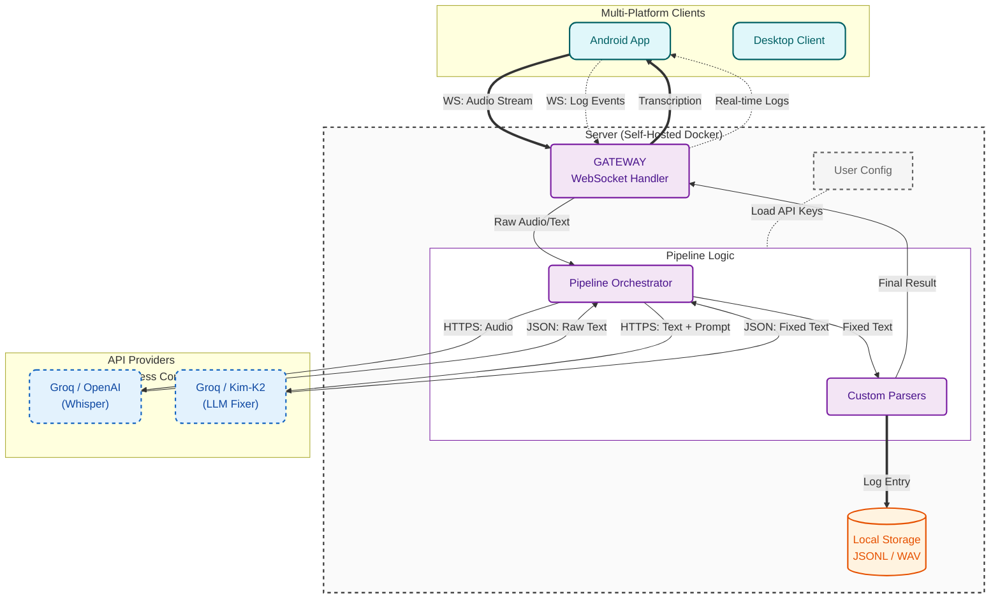

<div align="center">
  
  <h1>Reliquary</h1>
  <p><strong>A Zero-Friction Voice Bridge to Your AI Exobrain</strong></p>

  <p>
    <a href="#connect-clients">Download Client</a> •
    <a href="#deploy-your-digital-fortress-server">Deploy Server</a> •
    <a href="#architecture">Architecture</a> •
    <a href="https://discord.gg/rWtHcMvb">Discord</a> •
    <a href="docs/README.zh-CN.md">中文版</a>
  </p>

  
  
  
</div>

## Why I Built This

**Most people simply don't need voice input.**

Its only true value is acting as a high-bandwidth link between humans and AI.

If you aren't an AI power user, Reliquary is useless to you. But if you are, it eradicates input friction, letting you sync seamlessly with your AI exobrain for deep, uninterrupted thinking.

**The Real Bottleneck:**

You pay premium subscriptions for flagship models, yet barely scratch the surface of their potential. The bottleneck is no longer the AI's capability—it's the friction of getting thoughts into the machine.

Typing exacts a massive cognitive tax. Raw inspiration is multi-dimensional and chaotic; forcing it into text requires you to prematurely untangle logic, curate vocabulary, and police your grammar. This forced "flattening" of thought creates a heavy cognitive load, causing fleeting nuances to evaporate before they ever hit the screen.

Reliquary destroys this barrier, fundamentally shifting the paradigm. The AI evolves from a passive "Q&A dispenser" into a "logic collider." You can dump raw, unrefined intuition, engage in rapid-fire pushback to expose blind spots, and distill the absolute essence of your ideas. It’s how you finally crystallize half-formed thoughts into rigorous frameworks.

I've tried every voice tool on the market. They all suffer from unbearable flaws:

- **Aggressive Cutoffs & Pressure**: Pause for a single second to think, and the system prematurely cuts you off and replies. It forces you into a breathless rapid-fire interrogation, interrupting your flow, polluting the context window, and creating massive psychological pressure.

- **Unreliable Free Tools**: Riddled with transcription errors. One misheard technical term or mixed-language phrase, and the AI outputs complete garbage.

- **Overpriced & Walled Gardens**: Premium tools charge heavily without fundamentally improving the core experience, all while locking your private thoughts in their cloud.

- **Devastating Single Points of Failure**: You talk passionately for minutes, a network blip occurs, and hundreds of words vanish instantly. You can't even remember what you just said. The inspiration evaporates, leaving you completely derailed and frustrated.

The Reliquary Solution: A voice bridge engineered specifically for high-frequency AI interaction. Powered by a self-correcting mechanism, it enables zero-friction dialogue with your AI.

## Core Features

### 1. AI-Powered Auto-Correction

Built on Whisper Large-v3 and a dedicated LLM "Fixer" pipeline. Even if the initial transcription struggles, it uses context to automatically fix grammar, resolve homophones, and format code blocks.

It fully supports custom glossaries and Prompts, allowing you to build a correction engine tailored perfectly to your workflow.

### 2. Bulletproof Fallback

Raw audio is streamed and saved locally in real-time. Whether the network drops or the API crashes, your data is never lost. One click to retry.

### 3. Pressure-Free Flow

- **Infinite Pause Time**: Take all the time you need; it never rushes you.
- **Embrace the Chaos**: Speak incoherently, ramble, or contradict yourself.
- **Silent Refactoring**: The backend LLM acts as a silent editor, weaving your raw, chaotic thoughts into crisp, perfect instructions.

### 4. Your Data Sovereignty

All logs are stored locally by default. Your thought processes belong to you. These records are future-proofed to serve as your personal RAG memory bank.

### 5. Free & Uncompromising

As an extremely picky power user, I engineered this to perfection and open-sourced it (MIT). Optimized specifically for free, high-speed API tiers (like Groq), it handles high-frequency usage with zero extra cost.


## Quick Start

To use this software, you need: Client, Server, and a Groq API Key (completely free).

### Deploy Your Digital Fortress (Server)

You can choose to use Docker for local deployment (recommended), production-level deployment, or try the online demo.

#### 1. Local Docker Deployment (Recommended)
Ideal for quick start, testing, and personal use.

```bash
git clone https://github.com/sentimentalk/reliquary.git
cd reliquary
vim .env  # Modify as needed, optional
docker compose up -d
```
After starting, you can access:
- **Web Interface**: `http://localhost:3000`
- **Server API Service**: `http://localhost:8080`

#### 2. Production Server Deployment (Auto HTTPS)
When exposing the service to the public internet, automatic HTTPS is supported. The built-in Caddy will automatically apply for and renew SSL certificates for you, provided you have a domain name resolved to the server's IP address.

```bash
vim .env  # Modify as needed, optional
vim Caddyfile  # Fill in your domain name
docker compose -f docker-compose.prod.yml up -d
```

---

### Connect Clients

#### Installation Methods
<details>
<summary><strong>macOS</strong></summary>

Installing via Homebrew is recommended, as we will automatically handle permission configurations for you:
```bash
% brew tap sentimentalk/tap
% brew install reliquary
```
Start the client terminal:
```bash
% reliquary
```
Once the terminal starts, it will guide you to enter your **Server URL** (e.g., `http://localhost:8080`) and your personal **Access Token** (can be generated in the backend dashboard).
</details>

<details>
<summary><strong>Windows</strong></summary>

For Windows, using Scoop provides the best installation experience:
```powershell
scoop bucket add sentimentalk https://github.com/sentimentalk/scoop-bucket
scoop install reliquary
```
Start the client terminal:
```powershell
reliquary
```
Similarly, enter the server address and corresponding Token according to the command line prompts.
</details>

<details>
<summary><strong>Android</strong></summary>

The Android app is currently not available on Google Play. Please complete the installation via sideloading the APK:
1. Enable the "Install from Unknown Sources" option on your phone.
2. Visit the project's [GitHub Releases](https://github.com/sentimentalk/reliquary/releases) page to download and install the latest APK.
</details>

<details>
<summary><strong>iOS & Linux</strong></summary>

- **Linux**: Coming soon, stay tuned.
- **iOS**: The iOS client is currently under intensive development, please keep an eye on the repository's progress.
</details>

#### Build from Source (Local Build)

If you prefer a hands-on approach, you can compile the client directly from the source code.

<details>
<summary><strong>Desktop (macOS / Windows / Linux)</strong></summary>

**Requirements:** Go 1.21+

```bash
cd client
go build -o reliquary ./cmd
./reliquary
```
</details>

<details>
<summary><strong>Android</strong></summary>

**Requirements:** Go 1.21+, Android SDK & NDK, Gomobile

1. **Install Gomobile**:
```bash
go install golang.org/x/mobile/cmd/gomobile@latest
gomobile init
```

2. **Build Core Library (.aar)**:
```bash
# Set NDK path (replace with your installed NDK version)
export ANDROID_NDK_HOME=$HOME/Library/Android/sdk/ndk/26.3.11579264

cd client
gomobile bind -androidapi 26 -o android/app/libs/reliquary.aar -target=android ./mobile
```

3. **Build & Install APK**:
```bash
cd android
./gradlew assembleDebug
adb install -r app/build/outputs/apk/debug/app-debug.apk
```
</details>

#### First Run Configuration Guide:
1. **Server Address (URL)**: For local deployments, enter `http://localhost:8080`; for private servers, enter your actual address (e.g., `https://your-domain.com`).
2. **Identity Token (Access Token)**: After logging into the backend interface to register and create an account, obtain the system-generated personal Access Token and enter it.
3. **API Authorization**: In the backend UI's "Device Management" or "Settings," enter your **Groq API Key** to enable core transcription capabilities.

## Vision & Roadmap

Imagine:
- You casually rant about an architecture idea while eating or walking, and by the time you're home, your local pipeline has already transformed it into structured technical documentation, quietly sitting in your Obsidian.
- Your data is no longer a write-only graveyard. Stuck on a new feature? You can simply ask: "Based on my architectural thoughts from last month, how should I design this interface now?"

Reliquary is currently your most efficient "input funnel" for AI interaction. Its endgame is to become the "private data lake" of your digital life.

- **Phase 1: Core Stability (Current)**
  - [x] Multi-platform coverage (Android, Windows, macOS, Linux)
  - [x] High-precision transcription & context repair (Fixer Pipeline)
  - [x] Self-hosting & Data Sovereignty (Docker)

- **Phase 2: Protocol & Interconnection (Next Step)**
  - [ ] **Define Interaction Protocol**: Establish standardized input/output workflows (JSON Schema).
  - [ ] **Programmable Workflows (Webhooks & Ecosystem)**: It's not just about storage. Support pushing parsed, standardized payloads (JSON) to any Webhook. Whether it's auto-generating cards in Obsidian or triggering n8n/Zapier automation workflows, the destiny of your data stream is entirely yours to define.

- **Phase 3: Data Intelligence & Exocortex (Future)**
  - [ ] **Local Vector Retrieval (RAG)**: Your data no longer sleeps. Through local embeddings, query your past at any time: "What was that idea I had about system architecture last month?"
  - [ ] **Proactive Copilot**: Powered by your local long-term memory bank, it actively identifies blind spots in your logic trees—evolving from "you ask, it answers" to "it understands your context."
  - [ ] **Quantified Self & Echoes**: No more rigid weekly reports. A local background model continuously patrols your data, connecting seemingly unrelated thought nodes, allowing you to rediscover your own cognitive trajectory.

## Architecture

Reliquary implements a **Chain of Responsibility** pattern to orchestrate inbound audio streams. This decoupled design ensures fault tolerance, easy pipeline swapping, and distinct separation of concerns between raw transcription and semantic repair.



- **Whisper**: The stateless transcription bedrock. Bootstraps the pipeline by converting raw audio streams into an initial text payload.
- **The Fixer**: An autonomous LLM agent acting as a contextual linter. It autonomously resolves homophone collisions, injects missing punctuation, and formats code blocks before shipping the final payload to the client.

## License & Trademarks

**License**: This project is open-sourced under the MIT License. You are free to fork, modify, and distribute the code.

**Trademarks**:
The "Reliquary" name and Logo (specifically `web/public/logo.svg`, `web/public/logo-nav.svg`, and `web/public/favicon.svg`) are trademarks of the project creator.

- ✅ You **MAY** use the logo for personal use or when deploying an unmodified version of this software.
- ❌ You **MAY NOT** use the logo to endorse derived works or commercial products without explicit permission.

<br/>

<div align="center">
  <em>Run your AI exocortex at full power, at the native speed of thought.</em>
</div>
