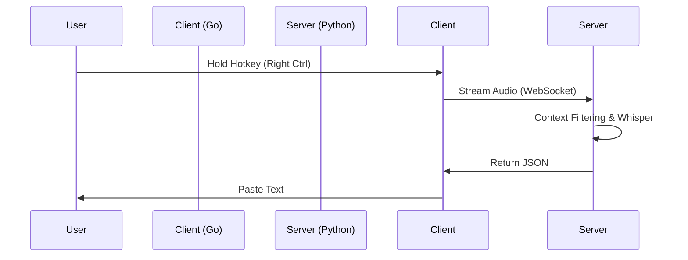

# Vortex

  

  <strong>The Local-First, High-Performance Voice Bridge for Digital Sovereignty.</strong>

  
  
  

---

## Table of Contents
- [English Version](#-english-version)
  - [What is Vortex?](#what-is-vortex)
  - [The Vortex Constitution](#the-vortex-constitution)
  - [Why AGPL v3?](#why-agpl-v3)
- [Architecture](#architecture)
- [Quick Start](#quick-start)
- [中文介绍](#-中文介绍)
  - [Vortex 是什么？](#vortex-是什么)
  - [Vortex 技术宪法](#vortex-技术宪法)
  - [为什么使用 AGPL v3 协议？](#为什么使用-agpl-v3-协议)
- [Roadmap](#roadmap-路线图)
- [Contact](#contact--联系作者)

---

## 🇺🇸 English Version

### What is Vortex?

Vortex is not just another wrapper around Whisper. It is a philosophy of **Data Sovereignty**.

In an era where every keystroke and spoken word is harvested by cloud giants, Vortex stands as a **"Dumb Client, Smart Server"** architecture designed to keep your thoughts yours. It turns your voice into a structured, searchable, and locally stored "Pipeline Trace" — instant, context-aware, and strictly private.

### The Vortex Constitution (Core Philosophy)

> [!IMPORTANT]
> These are the core principles that guide the development of Vortex.

1.  **Speed is Feature #1**: From keypress to text on screen, latency must be imperceptible.
2.  **Dumb Client, Smart Server**: The client is just a sensor (Mic + Hooks). The Server is the Brain (LLM + Storage).
3.  **Data Sovereignty**: Your logs are your assets. Files are the database (`.jsonl`).
4.  **Context Awareness**: No blind transcription. Vortex knows if you are coding in Python or writing a French diary, and adjusts the hotwords accordingly.

### Why AGPL v3?

Vortex is open source, but it is not open for exploitation.

We believe that the tools defining human-AI interaction should be transparent. If you use Vortex code to build a service, you must share your improvements with the community. **We strictly prohibit closed-source SaaS wrappers of this project.**

---

## Architecture

---

## Quick Start

*(Coming soon in Feb 2026 Release)*

---

## 🇨🇳 中文介绍

### Vortex 是什么？

Vortex 不仅仅是一个语音转文字工具，它是对抗 AI 数据霸权的一次尝试。

在这个所有数据都被云端巨头收割的时代，Vortex 采用 **“哑终端，智中枢”** 架构，旨在将人类思维瞬时转化为数字行动，同时确保你的数据主权。它将你的语音转化为结构化、可搜索、本地存储的“全链路日志”——不仅速度极快，而且具备语境感知能力。

### Vortex 技术宪法 (The Constitution)

> [!TIP]
> 这是我们在开发 Vortex 时恪守的绝对原则：

*   **速度即正义 (Speed is Feature #1)**: 从按下按键到文字上屏必须是瞬时的。
*   **哑终端，智中枢 (Dumb Client, Smart Server)**: 客户端只是传感器（麦克风+键盘钩子）。服务端才是大脑（LLM + 存储 + 路由）。
*   **数据主权 (Log-First)**: 用户数据是核心资产。文件即数据库（采用标准化的 JSONL 格式）。
*   **语境感知 (Context Awareness)**: 拒绝盲目的全局热词注入。系统具备“降噪”能力，根据当前对话的领域（如：写代码 vs 聊生活）动态过滤热词。

### 为什么使用 AGPL v3 协议？

Vortex 是开源的，但这不代表允许被白嫖和滥用。

我们坚信定义人机交互的工具必须是透明的。任何基于 Vortex 代码构建的服务（即使通过网络分发），都必须向社区开源其源代码。**我们严厉禁止任何形式的闭源套壳商业行为。**

---

## Roadmap (路线图)

- [ ] **Phase 1 (Feb 2026)**: 核心体验发布，解决 Windows 钩子与长语音超时问题。
- [ ] **Phase 2**: 运行时动态配置 (Runtime Config)。
- [ ] **Phase 3**: 智能语境降噪与领域分类器。

---

## Contact / 联系作者

**Designed by Xinghan in Canada.**
*Defending the boundary between human thought and digital capture.*