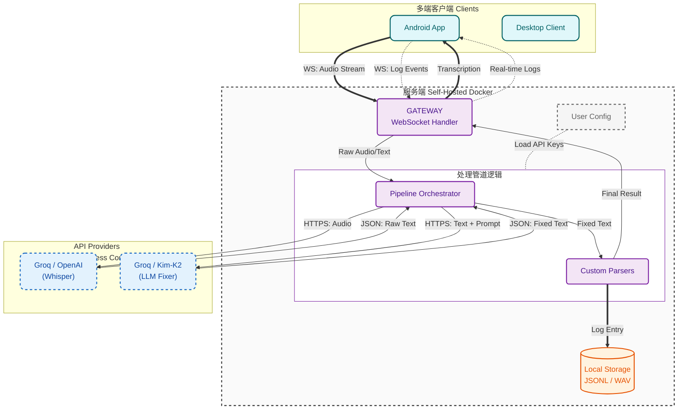

<div align="center">
  
  <h1>Reliquary</h1>
  <p><strong>零摩擦语音桥梁，直达你的AI外脑</strong></p>

  <p>
    <a href="#快速开始-客户端">下载客户端</a> •
    <a href="#部署你的数字堡垒-服务端">部署服务端</a> •
    <a href="#架构设计">架构设计</a> •
    <a href="https://discord.gg/rWtHcMvb">Discord 交流</a> •
    <a href="../README.md">英文版</a>
  </p>

  
  
  
</div>

## 我为什么开发了这个项目

**绝大多数人根本不需要语音输入。**

语音输入的唯一核心价值，在于它是人类与 AI 交互的高带宽链路。

如果你不深度使用AI，Reliquary对你毫无价值。反之，它能消除人机交互摩擦，让你与AI外脑高效共生，把精力专注在深度思考上。

**一个常见痛点：**

你为旗舰大模型支付高额订阅，却没真正发挥它们的价值。真正限制我们的早已不是模型能力，而是人机交互的摩擦力。

书面输入门槛极高：灵感本是立体发散的，但写下来需要强行梳理逻辑、挑选词句、保证语法。这“思维降维”过程消耗巨大，大量细节和灵感会在此丢失。

Reliquary消除了表达阻力，让交互发生质变。AI从“单次问答机”变为“逻辑碰撞机”。直接抛出想法，通过高频互相质询寻找盲点、直击本质，最终将未成形的想法彻底想透。

我试过各种语音工具，都存在难以忍受的问题：

- **激进打断与压力**：只要停顿思考一秒，系统就强行截断并立即回答。逼你陷入毫无喘息的“快问快答”，不仅打断思路、污染上下文，还给你必须快速回应的巨大压力。

- **免费工具不可靠**：转录错误太多，尤其技术术语和混合语言，导致AI输出完全无意义。

- **付费工具贵且有限**：收费很高，但核心体验没根本改善，私人想法还被锁在别人云端。

- **脆弱单点故障**：你滔滔不绝说了两三分钟，突然网络故障或转录错误，数百字灵感瞬间消失。你甚至记不起刚才说了什么，灵感随之蒸发。还得崩溃地重说一遍，情绪彻底受打击。

Reliquary的解决方案：专为AI高频交互设计的语音桥梁。它带自纠错机制，让你彻底零摩擦地与AI外脑对话。

## 核心特性

### 1. AI智能纠错

基于Whisper Large-v3 + LLM Fixer管道。即使识别出错，也能根据上下文自动修复语法、歧义，并优化格式。

支持完全自定义术语表和Prompt，打造专属你的纠错引擎。

### 2. 安心的兜底

录音实时流式保存本地。无论断网还是出错，内容绝不丢失，一键即可重试。

### 3. 无压迫心流

- 无限停顿时间，绝不催促。
- 允许语无伦次和自我否定。
- 后端LLM安静重构，把原生混乱整理成清晰指令。

### 4. 你的数据期权

所有日志默认本地存储。你的思考轨迹属于自己，未来可直接用于个人RAG记忆库。

### 5. 免费且强大

作为极度挑剔的核心用户，我把它打磨到极致，并且开源（MIT协议），专为Groq等免费高速API优化。支持高频使用，零额外成本。


## 快速开始

使用本软件你需要: 客户端, 服务端, Groq API Key (完全免费)

### 部署数字堡垒 (服务端)

你可以选择使用 Docker 本地部署（推荐）、产品级部署或是在线体验。

#### 1. Docker 本地部署 (推荐)
适合快速起步、测试和个人使用。

```bash
git clone https://github.com/sentimentalk/reliquary.git
cd reliquary
vim .env  # 根据需要修改, 非必需
docker compose up -d
```
启动后可以访问：
- **Web 界面**: `http://localhost:3000`
- **Server API 服务**: `http://localhost:8080`

#### 2. 私有服务器部署 (推荐)
在公网暴露服务时，支持自动 HTTPS。内置的 Caddy 会自动为你申请并续期 SSL 证书，前提是你需要准备一个已解析到该服务器 IP 的域名。

```bash
vim .env  # 根据需要修改, 非必需
vim Caddyfile  # 填入你的域名
docker compose -f docker-compose.prod.yml up -d
```

---

### 接入客户端

#### 安装方式
<details>
<summary><strong>macOS</strong></summary>

推荐通过 Homebrew 安装，我们会自动帮你处理好权限配置：
```bash
% brew tap sentimentalk/tap
% brew install reliquary
```
启动客户端终端：
```bash
% reliquary
```
终端启动后，会引导你输入你的 **Server URL**（如 `http://localhost:8080`）和你的个人 **Access Token**（可在后端面板生成）。
</details>

<details>
<summary><strong>Windows</strong></summary>

在 Windows 上，使用 Scoop 能获得最佳的安装体验：
```powershell
scoop bucket add sentimentalk https://github.com/sentimentalk/scoop-bucket
scoop install reliquary
```
启动客户端终端：
```powershell
reliquary
```
同样，根据命令行的提示输入服务端的地址以及对应 Token。
</details>

<details>
<summary><strong>Android</strong></summary>

当前安卓端暂未上架 Google Play，请通过侧载 APK 完成安装：
1. 开启手机的“允许安装未知来源应用”选项。
2. 访问项目的 [GitHub Releases](https://github.com/sentimentalk/reliquary/releases) 页面，下载最新的 APK 包进行安装。
</details>

<details>
<summary><strong>iOS & Linux</strong></summary>

- **Linux**: 即将发布，敬请期待。
- **iOS**: iOS 客户端正处于紧锣密鼓的开发中，敬请关注仓库进度。
</details>

#### 本地源码编译 (Build from Source)

如果你更倾向于极客的方式，也可以完全通过源码在本地编译各个客户端。

<details>
<summary><strong>桌面端 (macOS / Windows / Linux)</strong></summary>

**环境依赖**: Go 1.21+

```bash
cd client
go build -o reliquary ./cmd
./reliquary
```
</details>

<details>
<summary><strong>安卓端 (Android)</strong></summary>

**环境依赖**: Go 1.21+, Android SDK & NDK, Gomobile

1. **安装 Gomobile**:
```bash
go install golang.org/x/mobile/cmd/gomobile@latest
gomobile init
```

2. **编译核心库 (.aar)**:
```bash
# 设置 NDK 路径（请替换为你本地实际的 NDK 路径）
export ANDROID_NDK_HOME=$HOME/Library/Android/sdk/ndk/26.3.11579264

cd client
gomobile bind -androidapi 26 -o android/app/libs/reliquary.aar -target=android ./mobile
```

3. **编译并安装 APK**:
```bash
cd android
./gradlew assembleDebug
adb install -r app/build/outputs/apk/debug/app-debug.apk
```
</details>

#### 初次运行配置指南：
1. **服务器地址 (URL)**：本地部署请填写 `http://localhost:8080`，私有服务器请填写您的实际地址（如 `https://your-domain.com`）。
2. **身份令牌 (Token)**：登录后端界面注册并创建账号后，获取系统生成的个人 Access Token 并填入。
3. **API 授权**：在后端 UI 的“设备管理”或“设置”中，填入您的 **Groq API Key** 以启用核心识别能力。

## 愿景与路线图

想象一下：

- 你在吃饭、散步时随口吐槽的一个架构灵感，回到家时，已经被本地的 Pipeline 自动转化成了结构化的技术文档，并静静躺在你的 Obsidian 里。
- 你的数据不再是只写 (write-only) 的“坟墓”。当你在开发新功能卡壳时，你可以直接问：“结合我上个月对架构的思考，我现在应该怎么设计这个接口？”

Reliquary 目前是你与 AI 之间最高效的“输入漏斗”，而它的终局，是成为你数字生命的“私有数据湖”。

- **Phase 1: 核心稳固 (Current)**
  - [x] 多端覆盖 (Android, Windows, macOS, Linux)
  - [x] 高精度转录与上下文修复 (Fixer Pipeline)
  - [x] 自托管与数据主权 (Docker)

- **Phase 2: 协议化与互联 (Next Step)**
  - [ ] **定义交互协议**: 制定标准化的输入/输出格式 (JSON Schema)。
  - [ ] **泛用输出钩子 (Webhooks & Ecosystem)**: 不仅仅是存下来。支持将清洗后的标准化数据（JSON）推送到任意 Webhook。无论是自动写卡片到 Obsidian，还是触发 n8n/Zapier 自动化工作流，你的数据流向由你全权定义。

- **Phase 3: 数据智能与外脑 (Future)**
  - [ ] **本地向量检索 (RAG)**: 你的数据不再沉睡。通过本地向量化，你可以随时检索你的过去：“上个月我关于架构的那个想法是什么？”
  - [ ] **Agent 主动发现 (Proactive Copilot)**: 基于你的本地长期记忆库，主动指出你逻辑链路中的盲区，从“你问它答”进化为“它懂你的上下文”。
  - [ ] **数据量化与回声 (Quantified Self & Echoes)**: 不是生成死板的周报，而是通过后台的本地小模型持续巡检你的数据，连接看似无关的思考节点，让你重新认识自己的认知轨迹。

## 架构设计

Reliquary 使用 **责任链 (Chain of Responsibility)** 设计模式来处理音频流。



**Whisper**: 提供原始转录基础。

**The Fixer**: 一个专门的 LLM Agent，利用上下文修正同音词、添加标点并格式化代码块。

## 协议与商标

**License**: 本项目基于 MIT License 开源。你可以自由 Fork、修改和分发代码。

**商标声明**: "Reliquary" 名称及 Logo（具体为 `web/public/logo.svg`, `web/public/logo-nav.svg` 以及 `web/public/favicon.svg`）是项目创建者的商标。

- ✅ 你**可以**在个人使用或部署未修改的本软件时使用该 Logo。
- ❌ 未经明确许可，你**不得**使用该 Logo 为衍生作品或商业产品背书。

<br/>

<div align="center">
  <em>以思维的原始流速，全功率运转你的 AI 外脑。</em>
</div>