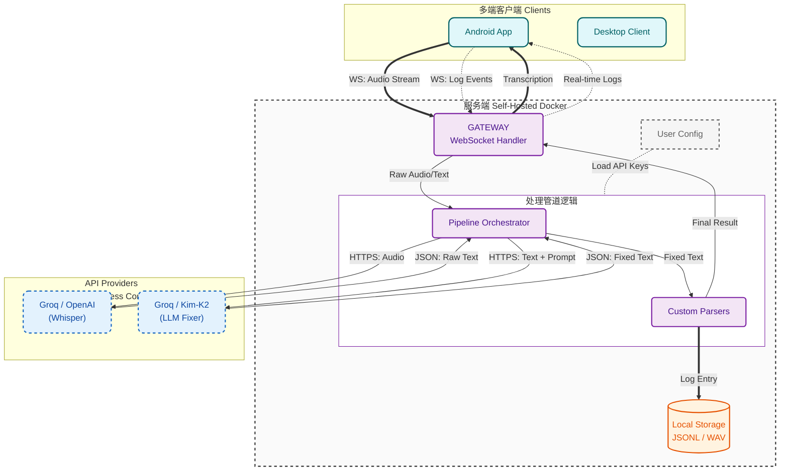

<div align="center">
  
  <h1>Reliquary</h1>
  <p><strong>全功率运转你的 AI 外脑</strong></p>

  <p>
    <a href="#快速开始-客户端">下载客户端</a> •
    <a href="#部署你的数字堡垒-服务端">部署服务端</a> •
    <a href="#架构设计">架构设计</a> •
    <a href="../README.md">英文版</a>
  </p>

  
  
  
</div>

## 我为什么开发了这个项目

**绝大多数人根本不需要语音输入。如果没有大模型，Reliquary 对你一文不值。** 语音输入的唯一核心价值，在于它是人类与 AI 交互的高带宽链路。

你可能已在为旗舰级大模型（如 Gemini Pro / Claude Pro）支付高额订阅费，但你真正发挥了它们的价值吗？受限于键盘的物理输入瓶颈，绝大多数人连大模型 1% 的潜力都无法释放。而作为 Reliquary 的重度依赖者，我每天通过高强度输入，能让这些顶级模型触及限流。

市面上的语音交互工具，在我看来多是“伪命题”：

- **免费的不可用**：识别错漏百出。只要核心术语错一个字，AI 就会输出驴唇不对马嘴的废话 (Garbage in, garbage out)。
- **可用的要加钱**：体验并没有产生质变，且你高价值的私有思考过程会被锁定在别人的云端。
- **脆弱的单点故障**：对着原生语音输入滔滔不绝两分钟，一旦网络闪断或识别报错，几百字的灵感瞬间人间蒸发，你根本想不起自己刚说了什么。这种挫败感是毁灭性的。

Reliquary 是为你准备的高带宽外脑接口。它不只是简单的录音笔，而是具备“自纠错机制”的思维漏斗。它让你彻底摆脱键盘束缚，以思维原本的速率与 AI 对话，让每一分订阅支出都物超所值。

## 核心特性

### 1. 极致的确定性 (The Fixer Pipeline)

**你无需时刻紧盯屏幕确认识别精度。**

内置由 LLM 驱动的 The Fixer 管道(支持自定义)，不仅能精准穿透中英夹杂的专业术语，还会自动修复语法逻辑、修正同音歧义，甚至能自动格式化代码块。你只需将想法倾泻而出，Reliquary 确保呈献给 AI 的，将是 100% 契合原意的精准表达。

### 2. 永不丢失的物理级保障

**从底层逻辑上终结“付诸东流”的忧虑。**

在向云端 API 发起请求之前，你的原始音频流已先行在本地硬盘安全沉淀。无论遇到断网、API 波动还是后端异常，只要声音发出，音频与原始记录便会永远留存于你的硬盘中。拒绝让任何一秒的灵感随技术故障而消散。

### 3. 无感心流体验

**告别激进的静音打断机制。**

- 不管你是吃饭、走路还是躺着，不需要在脑海里预先组织完美的语言。说废话、停顿、结巴都没关系，你拥有无限的思考时间，后端会自动将你的混乱提炼成完美的 Prompt。

### 4. 你的数据期权

**每一份高价值的思考成果，都不应只是昙花一现。**

- **Local First**: 默认将所有语音及文本日志落盘本地。
- **Future-Proof**: 它是当下的高效输入利器；也是未来的私有资产。未来(配合本地 RAG)，这些记录即是你个人专属的训练集与外脑记忆库。

### 5. 企业级交互，极致的效能平衡

**作为极度挑剔的核心用户，我吃下了所有的开发复杂度，只为换取你输入时的零负担。**

- **开源自由**: 基于 MIT 协议，无订阅制，无付费墙。
- **架构优势**: 专为顶级算力提供商（如 Groq）的免费资源层进行架构优化。每日处理百条高频指令，依然能保持秒级响应，且不产生任何费用。


## 快速开始

使用本软件你需要: 客户端, 服务端, Groq API Key (完全免费)

### 部署数字堡垒 (服务端)

你可以选择使用 Docker 本地部署（推荐）、产品级部署或是在线体验。

#### 1. Docker 本地部署 (推荐)
适合快速起步、测试和个人使用。

```bash
git clone https://github.com/sentimentalk/reliquary.git
cd reliquary
vim .env  # 根据需要修改, 非必需
docker compose up -d
```
启动后可以访问：
- **Web 界面**: `http://localhost:3000`
- **Server API 服务**: `http://localhost:8080`

#### 2. 私有服务器部署 (推荐)
在公网暴露服务时，支持自动 HTTPS。内置的 Caddy 会自动为你申请并续期 SSL 证书，前提是你需要准备一个已解析到该服务器 IP 的域名。

```bash
vim .env  # 根据需要修改, 非必需
vim Caddyfile  # 填入你的域名
docker compose -f docker-compose.prod.yml up -d
```

---

### 接入客户端

#### 安装方式
<details>
<summary><strong>macOS</strong></summary>

推荐通过 Homebrew 安装，我们会自动帮你处理好权限配置：
```bash
% brew tap sentimentalk/tap
% brew install reliquary
```
启动客户端终端：
```bash
% reliquary
```
终端启动后，会引导你输入你的 **Server URL**（如 `http://localhost:8080`）和你的个人 **Access Token**（可在后端面板生成）。
</details>

<details>
<summary><strong>Windows</strong></summary>

在 Windows 上，使用 Scoop 能获得最佳的安装体验：
```powershell
scoop bucket add sentimentalk https://github.com/sentimentalk/scoop-bucket
scoop install reliquary
```
启动客户端终端：
```powershell
reliquary
```
同样，根据命令行的提示输入服务端的地址以及对应 Token。
</details>

<details>
<summary><strong>Android</strong></summary>

当前安卓端暂未上架 Google Play，请通过侧载 APK 完成安装：
1. 开启手机的“允许安装未知来源应用”选项。
2. 访问项目的 [GitHub Releases](https://github.com/sentimentalk/reliquary/releases) 页面，下载最新的 APK 包进行安装。
</details>

<details>
<summary><strong>iOS & Linux</strong></summary>

- **Linux**: 即将发布，敬请期待。
- **iOS**: iOS 客户端正处于紧锣密鼓的开发中，敬请关注仓库进度。
</details>

#### 初次运行配置指南：
1. **服务器地址 (URL)**：本地部署请填写 `http://localhost:8080`，私有服务器请填写您的实际地址（如 `https://your-domain.com`）。
2. **身份令牌 (Token)**：登录后端界面注册并创建账号后，获取系统生成的个人 Access Token 并填入。
3. **API 授权**：在后端 UI 的“设备管理”或“设置”中，填入您的 **Groq API Key** 以启用核心识别能力。

## 愿景与路线图

想象一下：

- 你在吃饭、散步时随口吐槽的一个架构灵感，回到家时，已经被本地的 Pipeline 自动转化成了结构化的技术文档，并静静躺在你的 Obsidian 里。
- 你的数据不再是只写 (write-only) 的“坟墓”。当你在开发新功能卡壳时，你可以直接问：“结合我上个月对架构的思考，我现在应该怎么设计这个接口？”

Reliquary 目前是你与 AI 之间最高效的“输入漏斗”，而它的终局，是成为你数字生命的“私有数据湖”。

- **Phase 1: 核心稳固 (Current)**
  - [x] 多端覆盖 (Android, Windows, macOS, Linux)
  - [x] 高精度转录与上下文修复 (Fixer Pipeline)
  - [x] 自托管与数据主权 (Docker)

- **Phase 2: 协议化与互联 (Next Step)**
  - [ ] **定义交互协议**: 制定标准化的输入/输出格式 (JSON Schema)。
  - [ ] **泛用输出钩子 (Webhooks & Ecosystem)**: 不仅仅是存下来。支持将清洗后的标准化数据（JSON）推送到任意 Webhook。无论是自动写卡片到 Obsidian，还是触发 n8n/Zapier 自动化工作流，你的数据流向由你全权定义。

- **Phase 3: 数据智能与外脑 (Future)**
  - [ ] **本地向量检索 (RAG)**: 你的数据不再沉睡。通过本地向量化，你可以随时检索你的过去：“上个月我关于架构的那个想法是什么？”
  - [ ] **Agent 主动发现 (Proactive Copilot)**: 基于你的本地长期记忆库，主动指出你逻辑链路中的盲区，从“你问它答”进化为“它懂你的上下文”。
  - [ ] **数据量化与回声 (Quantified Self & Echoes)**: 不是生成死板的周报，而是通过后台的本地小模型持续巡检你的数据，连接看似无关的思考节点，让你重新认识自己的认知轨迹。

## 架构设计

Reliquary 使用 **责任链 (Chain of Responsibility)** 设计模式来处理音频流。



**Whisper**: 提供原始转录基础。

**The Fixer**: 一个专门的 LLM Agent，利用上下文修正同音词、添加标点并格式化代码块。

## 协议与商标

**License**: 本项目基于 MIT License 开源。你可以自由 Fork、修改和分发代码。

**商标声明**: "Reliquary" 名称及 Logo (位于 `web/public/*.svg`) 是项目创建者的商标。

- ✅ 你**可以**在个人使用或部署未修改的本软件时使用该 Logo。
- ❌ 未经明确许可，你**不得**使用该 Logo 为衍生作品或商业产品背书。

<br/>

<div align="center">
  <em>以思维的原始流速，全功率运转你的 AI 外脑。</em>
</div>