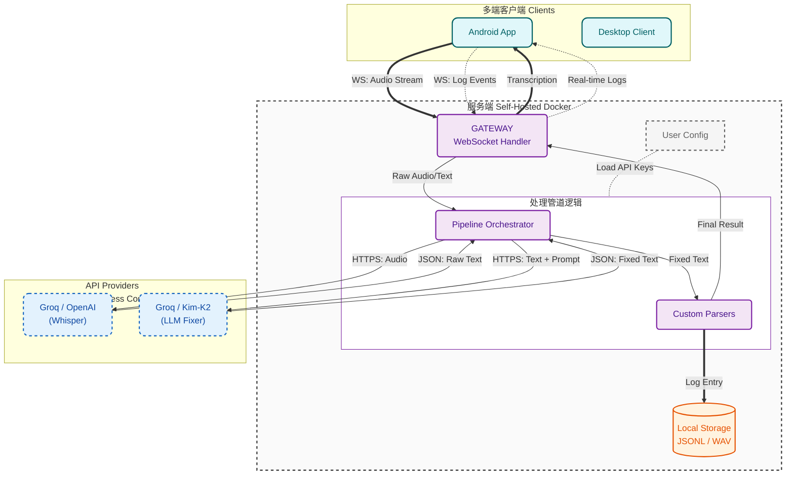

<div align="center">
  
  <h1>Reliquary</h1>
  <p><strong>为思维打造的数字命匣</strong></p>

  <p>
    <a href="#-快速开始-客户端">下载客户端</a> •
    <a href="#-部署你的数字堡垒-服务端">部署服务端</a> •
    <a href="#-架构设计">架构设计</a>
  </p>

  
  
  
</div>

## 宣言 (The Manifesto)

Reliquary 要解决的不仅仅是“语音转文字”的问题，而是现代人与数字世界交互的三重困境：

### 1. 高摩擦导致思维流失 (Friction Kills Flow)
灵感稍纵即逝，而掏出手机、打开笔记应用、敲击键盘的过程太过繁琐。打字速度（40-60 wpm）远远落后于思维速度（150+ wpm）。这种速率的不匹配，导致大量高价值的思维碎片因“懒得记”而熵增消散。

### 2. “只写存储”的数据坟墓 (Write-Only Memory)
即使你记录了，大部分笔记也沦为“死数据”。笔记本（无论是纸质还是 Notion）往往变成了思维的坟墓——你只负责存，却极少能高效地回溯和利用。没有被结构化和索引的思想，毫无价值。

### 3. 云端奴役与数据主权 (SaaS Feudalism)
现有的语音助手是“围墙花园”，而非你的“外脑”。
- **不可控**：激进的静音检测打断你的思考，污染上下文。
- **不属于你**：你的数据成为大模型训练的养料。
- **随时消失**：对于大厂，你的个人记忆是低价值数据，随时可能被清理或被算法忽略。

### Reliquary 的答案：
Reliquary 是一个 **私有化部署 (Self-Hosted)** 的个人数字资产 I/O 协议。它不仅是高精度的语音输入终端，更是你思维的 **“数字命匣” (Digital Phylactery)**。
它将你转瞬即逝的生物信号（语音），转化为永存的、结构化的数字资产 (Relics)，供未来的你（或你的专属 Agent）无限挖掘。

### 开发者寄语 (Top 0.1% AI 重度用户):
> "Reliquary 是我存放数字灵魂的匣子。它不仅记录过去，更是开启未来的钥匙。"

我开发 Reliquary 的初衷是极度功利的：我无法忍受低效的打字拖累大脑。我需要一个 **“思维缓冲区” (Mind Buffer)**，让我能通过 **“出声思考 (Thinking Aloud)”** 来清理逻辑，而不被任何 UI 交互打断。

但在构建过程中，我看到了更深层的危机：**数据即法力 (Data is Mana)**。
如果通往 AGI 的未来是魔法时代，那么属于你的数据就是你的法力值。现在，你把所有的法力都拱手让给了云端巨头。他们拥有跨越时间的洞察力，把你之前的一句不舒服和今天的症状关联起来，为发现早期癌症提供线索，而我们一无所有。为什么我们不能自己构建这个数据库，让所有 AI 模型在同一起跑线上为我们服务？

**Reliquary 旨在填补这个断层。**
我不希望我的数据碎片化地散落在十个 SaaS 孤岛里。我要建立一个统一的、Raw Data 级别的 **思维数据湖**。
当未来的 GPT-10 或本地 AI Agent 到来时，我有满满一仓库的“灵魂切片”供它读取。它将瞬间成为这个世界上最懂我的副手，因为我拥有这一整个时代的记忆备份。

Reliquary 不止是语音转文字+记录，它是你面对 AI 时代的底气。

## 为什么选择 Reliquary?

### 1. 极致的效率

**为“出声思考 (Thinking Aloud)”而生，杜绝“被打断”的焦虑。**
市面上的语音助手大多内置了激进的静音检测。你稍微停顿思考，它就判定输入结束并开始处理。虽然有些平台允许你打断 AI 的回复，但是这种机制会打断你的思维流，而且污染了上下文，你也不知道 AI 到底听到了多少，上一句的语境是否还在。
语音输入才能提供一个 **“思维缓冲区”**，让你完整地组织语言、修正逻辑、甚至在沉默中思考，最终你给 AI 提供的是经过深思熟虑的 **Clean Data**，而不是充满噪声的碎片 (你不知道你的语音被识别成了什么，是否在关键的事实上出现错误)，让 AI 不必浪费算力去猜谜，而是专注于解决问题。

**异步并行思考**
打破“提问-等待-回复”的线性低效循环。你可以连续抛出多个复杂的语音 Prompt，利用 AI 处理的时间去思考下一个子问题。不要让 AI 代替你思考，而是让 AI 追赶你的思维速度。作为此工具的 Power User，有了这个工具之后我甚至触及了 Gemini Pro 的速率限制，这是一个质的效率飞跃。我跟很多人讲过语音输入的好处但是他们并不像我一样使用 AI, 这很可能是个很小的垂类产品但是我会一直维护它，因为他对我是有非常实质性的帮助的。

### 2. 零成本的企业级体验 (Zero Cost, Enterprise Grade)

- **The Fixer (修正器)**: Reliquary 不只是转录，它会修复。一个基于上下文的 LLM Agent (北美部署的开源模型) 会自动修正同音字、根据语气添加标点、甚至格式化代码块。
- **高度可编程**: Reliquary 是极度 Flexible 的。无论你是否懂代码，都可以用自然语言定义“修正规则”。市面上的功能我们可以轻松实现，市面上没有的你可以自己加。
- **API 经济黑客**：通过精妙的架构设计，利用现代 API 提供商（主要是 Groq）慷慨的 Free Tier。你每天可以发送数百条高上下文的指令，拥有企业级的响应速度和准确率，而成本为零。

### 3. 命匣机制 (Phylactery Mechanism)

- **全量留存**：Reliquary 存储一切——原始音频 (Raw Audio)、初步转录 (Raw Text)、修正文本 (Fixed Text) 和元数据 (Metadata)。
- **未来友好 (Future-Proofing)**：也许今天的模型无法分析你语气的微小颤抖，但明天的模型可以。只要原始数据在你手里，你就在不断积累未来的资产。
- **Docker 一键部署**：你的数据死死锁在你自己的物理硬盘上 (VPS/NAS)。这是你的数字堡垒，拒绝任何云端审查或删除。
- **自定义价值锚点**: 对大厂而言，你的数据只是成千上万样本中的沧海一粟，他们只存储对算法有价值的数据，而剔除对你有价值的琐事。在 Reliquary，什么是重要的由你定义。你构建的是属于你自己的记忆库，而不是大厂画像库的一部分。

### 4. 可编程 I/O 端口

Reliquary 是处理语音的乐高积木。
**Pipeline**：VAD -> 转录 -> 修正器 -> 自定义解析器。想在存储前自动屏蔽敏感词？想自动提取 Todo 到看板？管道由你定义。
- **模块化管道**: 所有的处理步骤都是模块化的。
- **全平台轻量化**: 所有重逻辑都在服务端。客户端 (Android/Desktop) 极致轻薄、秒开、省电，它们只是你外脑的纯粹输入终端。

## 愿景与路线图 (Vision & Roadmap)

我们不仅仅是在做一个 App，我们致力于构建一个 **Reliquary Interaction Protocol (RIP)**。

- **当前的痛点**：人类的自然语言流（Unstructured）与机器的结构化数据（Structured）之间存在巨大的鸿沟。
- **我们的目标**：定义一套通用的 Schema，让 Reliquary 成为人类大脑与数字世界的通用接口。

想象一下：
- 你不再需要手动整理 Notion，因为 Reliquary 自动将你的语音日志结构化归档。
- 你不再需要回忆上周的会议细节，因为本地向量数据库已经索引了你所有的数据。

Reliquary 是你的外脑输入端口。它现在是一个高效的录音笔，未来它将是你数字生命的数据基石。

### Phase 1: 核心稳固 (Current)

- [x] 多端覆盖 (Android, Windows, macOS, Linux)
- [x] 高精度转录与上下文修复 (Fixer Pipeline)
- [x] 自托管与数据主权 (Docker)

### Phase 2: 协议化与互联 (Next Step)

- [ ] 定义交互协议 (Standardized Protocol): 制定标准化的输入/输出格式 (JSON Schema)。无论你是用手机、手表还是未来的智能眼镜，只要遵循此协议，就能将数据汇入你的“命匣”。
- [ ] 生态扩展: 支持将标准化数据推送到 Obsidian、Notion、S3、云存储平台 或任何第三方系统，实现自动化工作流。

### Phase 3: 数据智能与外脑 (Future)

- [ ] 本地向量检索 (RAG): 你的数据不再沉睡。通过本地向量化，你可以随时向你的过去提问：“上个月我关于架构的那个想法是什么？”
- [ ] Agent 主动提醒: 基于长期记忆，主动发现你思维盲区的助手。
- [ ] 数据分析量化自我: 自动生成日报、周报、年报，通过数据让你重新认识你自己

## 快速开始: 客户端

在开始之前，你需要一个运行中的服务端（见下方部署章节）。

### macOS (Homebrew)

```bash
brew tap sentimentalK/reliquary
brew install reliquary
```

### Windows (Scoop)

```powershell
scoop bucket add reliquary https://github.com/SentimentalK/scoop-bucket
scoop install reliquary
```

### Android

从 [GitHub Releases](https://github.com/SentimentalK/reliquary/releases) 下载最新 APK。

**客户端设置指南**: 安装后，将客户端指向你的服务器 URL。阅读连接指南。

## 部署你的数字堡垒 (服务端)

你有三种方式运行 Reliquary 核心。

### 选项 A: "即刻体验" (Web Demo)

```markdown
还没服务器？你可以先在我们的演示环境快速试用。
[进入演示环境 (Demo)](#http://localhost:3000)

> 注意：此处仅供功能预览，非商业服务。由于服务器资源有限，所有账号及数据将在注册 24 小时后被自动清理。如需长期使用，请务必参考下方的私有化部署方案。
```

### 选项 B: 本地部署 (开发/试驾)

在笔记本上运行完整栈（构建自源码）。

#### 1. 克隆仓库
```bash
git clone https://github.com/SentimentalK/reliquary.git
cd reliquary
```

#### 2. 配置
```bash
cp .env.example .env
# 编辑 .env 并添加你的 GROQ_API_KEY
```

#### 3. 启动服务
```bash
docker-compose up -d --build
```

**访问**:
- Frontend: `http://localhost:3000`
- Backend API: `http://localhost:8080/api/`

### 选项 C: 生产环境服务器 (推荐)

使用 GitHub Container Registry (GHCR) 的预构建镜像直接部署。适合在 VPS (AWS, DigitalOcean, Hetzner) 上 24/7 运行。包含通过 Caddy 实现的自动 HTTPS。

**准备**: 一个指向你服务器 IP 的域名。

**1. 配置**:
- **编辑 .env**: 设置 `DOMAIN_NAME=yourdomain.com` 及 API Key。
- **编辑 Caddyfile**: 将 `:80` 替换为 `yourdomain.com`。

**2. 部署**:
```bash
docker-compose -f docker-compose.prod.yml up -d
```
此命令将拉取最新镜像并启动 Gateway (Caddy), Frontend, 和 Backend。

**连接**: 在手机/桌面客户端中使用 `https://yourdomain.com`。

## 架构设计

Reliquary 使用 **责任链 (Chain of Responsibility)** 设计模式来处理音频流。



**Whisper**: 提供原始转录基础。

**The Fixer**: 一个专门的 LLM Agent，利用上下文修正同音词、添加标点并格式化代码块。

## 📜 协议与商标

**License**: 本项目基于 MIT License 开源。你可以自由 Fork、修改和分发代码。

**商标声明**:
"Reliquary" 名称及 Logo (位于 `web/public/logo.svg`) 是项目创建者的商标。

✅ 你 **可以** 在个人使用或部署未修改的本软件时使用该 Logo。

❌ 未经明确许可，你**不得**使用该 Logo 为衍生作品或商业产品背书。

<div align="center">
<em>Unlock your digital soul.

Deploy Reliquary.</em>
</div>