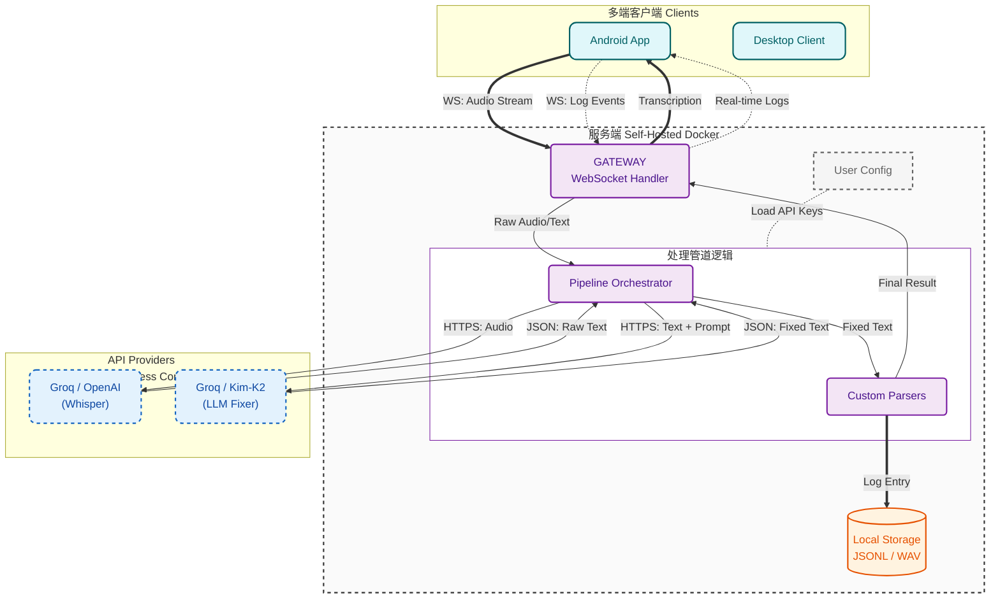

<div align="center">
  
  <h1>Reliquary</h1>
  <p><strong>为思维打造的数字命匣</strong></p>

  <p>
    <a href="#-快速开始-客户端">下载客户端</a> •
    <a href="#-部署你的数字堡垒-服务端">部署服务端</a> •
    <a href="#-架构设计">架构设计</a>
  </p>

  
  
  
</div>

##  别成为AI的瓶颈

现在的大模型拥有极其恐怖的推理能力。 但你连它 1% 的算力都用不到。为什么？

因为你被键盘的物理限制锁死了。

只有极致的语音输入，才能解锁你的大脑。Reliquary 将语音转文字，通过完全零负担的思维记录，帮你接通前往超级个体的“宽带光纤”。

它让你扔掉键盘，以思维原本的流速与 AI 交互。*（如果不跟 AI 高效交互，其实大多数人根本用不上语音输入。）*

## 核心特性 (Features)

### 1. Zero Friction Streaming (零摩擦流式输入)

- 别管语法，别管逻辑，不需要组织语言。
Reliquary 允许你处于“心流”状态中随便说。不管是吃饭、走路还是躺着，你只管把想法喷出来。大模型给你兜底。

### 2. Context-Aware Repair (上下文感知修复)

- 与大模型交互重要的不是字对不对。Reliquary在乎的是意图对不对。

- 内置 **The Fixer** 管道：利用 LLM 自动修复错词、补充标点、甚至格式化代码块。

- 它不追求 100% 的逐字准确，它追求 100% 的意图传达。

### 3. Your Data, Your Rules (你的数据主权)

- **Local First**: 所有数据存储在本地。
- **Private Memory**: 你的对话历史是你个人的“私有训练集”。
- **No SaaS BS**: 拒绝订阅制，拒绝数据被大厂拿去训练。

### 4. 1000% FREE (完全免费 & 开源)

- **开源免费**: 代码完全开源 (MIT)，没有付费墙。
- **完全零成本**:  LLM API 专为 Groq 的免费层优化

## 为什么它不一样？(Why Reliquary?)

| Feature | 传统语音助手 (Siri/ChatGPT Voice) | 传统笔记 (Notion/Obsidian) | Reliquary |
| :--- | :--- | :--- | :--- |
| **交互模式** | 简短指令 (Turn-based) | 结构化归档 (Archiving) | **流式思维 (Streaming)** |
| **打断机制** | 激进的静音检测 (一停顿就断) | 无 | **无打断 (思考多久都行)** |
| **数据归宿** | 大厂服务器 (用于训练) | 云端数据库 | **本地 Docker (你的硬盘)** |
| **成本** | 免费但弱智 / 订阅制 | 订阅制 / 买断 | **开源免费 (MIT)** |
| **核心价值** | 省事 | 存储 | **扩容大脑带宽** |

## 愿景与路线图 (Vision & Roadmap)

想象一下：
- 你不再需要手动整理 Notion，因为 Reliquary 自动将你的语音日志结构化归档。
- 你不再需要回忆上周的会议细节，因为本地向量数据库已经索引了你所有的数据。

Reliquary 是你的外脑输入端口。它现在是一个高效的录音笔，未来它将是你数字生命的数据基石。

**Phase 1: 核心稳固 (Current)**
  - [x] 多端覆盖 (Android, Windows, macOS, Linux)
  - [x] 高精度转录与上下文修复 (Fixer Pipeline)
  - [x] 自托管与数据主权 (Docker)

**Phase 2: 协议化与互联 (Next Step)**
  - [ ] 定义交互协议 (Standardized Protocol): 制定标准化的输入/输出格式 (JSON Schema)。无论你是用手机、手表还是未来的智能眼镜，只要遵循此协议，就能将数据汇入你的“命匣”。
  - [ ] 生态扩展: 支持将标准化数据推送到 Obsidian、Notion、S3、云存储平台 或任何第三方系统，实现自动化工作流。

**Phase 3: 数据智能与外脑 (Future)**
  - [ ] 本地向量检索 (RAG): 你的数据不再沉睡。通过本地向量化，你可以随时向你的过去提问：“上个月我关于架构的那个想法是什么？”
  - [ ] Agent 主动提醒: 基于长期记忆，主动发现你思维盲区的助手。
  - [ ] 数据分析量化自我: 自动生成日报、周报、年报，通过数据让你重新认识你自己

## 快速开始: 客户端

在开始之前，你需要一个运行中的服务端（见下方部署章节）。

- **macOS (Homebrew)**
  ```bash
  brew tap sentimentalK/reliquary
  brew install reliquary
  ```

- **Windows (Scoop)**
  ```powershell
  scoop bucket add reliquary https://github.com/SentimentalK/scoop-bucket
  scoop install reliquary
  ```

- **Android**
  从 [GitHub Releases](https://github.com/SentimentalK/reliquary/releases) 下载最新 APK。
  
  **客户端设置指南**: 安装后，将客户端指向你的服务器 URL。阅读连接指南。

## 部署你的数字堡垒 (服务端)

你有三种方式运行 Reliquary 核心。

- **选项 A: "即刻体验" (Web Demo)**
  ```markdown
  还没服务器？你可以先在我们的演示环境快速试用。
  [进入演示环境 (Demo)](#http://localhost:3000)
  
  > 注意：此处仅供功能预览，非商业服务。由于服务器资源有限，所有账号及数据将在注册 24 小时后被自动清理。如需长期使用，请务必参考下方的私有化部署方案。
  ```

- **选项 B: 本地部署 (开发/试驾)**
  在笔记本上运行完整栈（构建自源码）。
  1. **克隆仓库**:
     ```bash
     git clone https://github.com/SentimentalK/reliquary.git
     cd reliquary
     ```
  2. **配置**:
     ```bash
     cp .env.example .env
     # 编辑 .env 并添加你的 GROQ_API_KEY
     ```
  3. **启动服务**:
     ```bash
     docker-compose up -d --build
     ```
  4. **访问**:
        - Frontend: `http://localhost:3000`
        - Backend API: `http://localhost:8080/api/`

- **选项 C: 生产环境服务器 (推荐)**
  使用 GitHub Container Registry (GHCR) 的预构建镜像直接部署。适合在 VPS (AWS, DigitalOcean, Hetzner) 上 24/7 运行。包含通过 Caddy 实现的自动 HTTPS。
  
  **准备**: 一个指向你服务器 IP 的域名。
  1. **配置**:
     - **编辑 .env**: 设置 `DOMAIN_NAME=yourdomain.com` 及 API Key。
     - **编辑 Caddyfile**: 将 `:80` 替换为 `yourdomain.com`。
  2. **部署**:
     ```bash
     docker-compose -f docker-compose.prod.yml up -d
     ```
     此命令将拉取最新镜像并启动 Gateway (Caddy), Frontend, 和 Backend。
  3. **连接**: 在手机/桌面客户端中使用 `https://yourdomain.com`。

## 架构设计

Reliquary 使用 **责任链 (Chain of Responsibility)** 设计模式来处理音频流。



**Whisper**: 提供原始转录基础。

**The Fixer**: 一个专门的 LLM Agent，利用上下文修正同音词、添加标点并格式化代码块。

## 协议与商标

**License**: 本项目基于 MIT License 开源。你可以自由 Fork、修改和分发代码。

**商标声明**:
"Reliquary" 名称及 Logo (位于 `web/public/logo.svg`) 是项目创建者的商标。

✅ 你 **可以** 在个人使用或部署未修改的本软件时使用该 Logo。

❌ 未经明确许可，你**不得**使用该 Logo 为衍生作品或商业产品背书。

<div align="center">
<em>Unlock your digital soul.

Deploy Reliquary.</em>
</div>